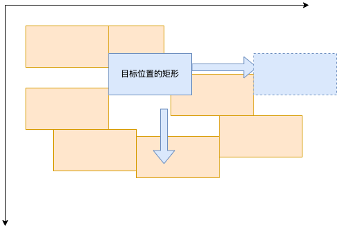

1. 复杂度宏观讲是O(N²)，具体讲是O((N²/2) + N/2)
    原因：较大值的N²还是很大的，虽然只有一进行了大概一半
    
2. 
    - `byte` 字节：指计算机内的存储单位，1字节=8比特（8位二进制）
    - `character` 字符: 数字+字母+符号,1字符占用1字节.(只是英文字母和符号,标准规范于ASCII表)
    - `string`: 字符串: 字符组成的串,

    <br />

    - `Unicode`:一种标准,包含世界所有国家地区字符的编码
    - `UTF-8`: `Unicode`的一种实现,使用最多.规定1字符为1-4字节,汉字为3字节
    - `GB2312`: `国标`2312,对原ASCII表的扩充,补充了汉字和中文字符,两个大于127字节的解析为汉字
    - `UTF-16`: 不与ASCII和ASCII扩展编码兼容,2字节代表1字符
    - `GB18030`: `GB2312`的扩展,遵照Unicode3.1
3. 目前使用的是Mac+IOS,
    - `ugit`:一个内部的git客户端, 会留有反馈方式,如有问题直接反馈到接口人
    - `vscode`: 广泛吸收社区里的声音,较好的插件会被直接引入官方功能中
4. - 工厂模式专注于产品总体,建造者模式专注于产品的每一部分
   - 适配器是对原有功能进行翻译转换,装饰器是对原有功能进行扩展
   - 工厂模式: 
    ```js
    class ProductA{}
    class ProductB{}
    class Factory{
        constructor(product){
            if(product === 'A'){
                return new ProductA()
            }else if(product == 'B'){
                return new ProductB()
            }
        }
    }
    ```
    - 建造者模式
    ```js
    class CarColor{

    }
    class CarWheel{
    
    }
    class Car{
        constructor(color, num){
            this.color = new CarColor(color)
            this.wheel = new CarWheel(num)
        }
    }
    class CreateCar{
        constructor(color, num){
            return new Car(color, num)
        }
    }

    ```
    - 装饰器
    ```js
    class NormalApple{
    constructor(){
        this.color = 'red&green'
    }
    getColor(){
        return this.color
    }
    }
    // 平安夜的苹果
    class ChristmasApple extends NormalApple{
        constructor(){
            super();
            this.box = 'box'; // 给普通苹果装饰上盒子去卖掉
        }
    }
    ```
    - 适配器
    ```js
    // 家用电
    class HouseElect{
        constructor(){
            this.pow = 220; // 家用电压220v
        }
    }

    // 手机充电器转换电压等
    class PhoneCharger{
        constructor(){
            this.elect = new HouseElect();
        }
        translate(){
            // ...
            return this.elect.pow / 44 // 达到5V2A
        }
    }
    ```
5. javascript
    - 优点: 
        - 因为是弱类型, 是变量声明灵活
        - 浏览器可直接执行,无需编译
        - 入门简单, 运行方式多样,可以再nodejs环境下做服务器语言
        - 一直在完善语言,借鉴其他语言
        
    - 缺点:
        - 最初设计原则为面向过程的简单处理
        - 也由于是弱类型,大型项目的变量混乱
        - 各个环境比较难做到统一规范,不同浏览器运行相同代码,可能结果不一样
        - number型 变量存在失精计算问题
        - 新API新规范变化较快,几乎每个项目都会要去做兼容
        - 变量的底层实现有各种奇奇怪怪的问题

    php
    - 优点:
        - 上手容易
        - 多年沉淀,社区较多
    - 缺点:
        - 没有专门的对象结构,得使用array替代
        - 变量有强制要求加 `$`
6. 
    - 可变对象: 对象内部的属性可以新增,删除,变更
    - 不可变对象: 对象内部的属性不能随意 增删改
7. 
```js
let reactive = function({leftChildren, rightChildren}){
    this.leftChildren = leftChildren;
    this.rightChildren = rightChildren;
    return this
}
let computed = function(callback){
    // 当获取getter时才会重新拿到值
    return new Proxy({
        value: null
    }, {
        get(target, key, receiver){
            if(key == 'value'){
                let result =  callback();
                Reflect.set(target, key, result, receiver);
                return result;
            }else{
                Reflect.get(target, key, receiver)
            }
        }
    })
}
const node = reactive({
    leftChildren: 1,
    // rightChildren: 0
}) 
console.log(node.leftChildren, node.rightChildren) // 1 undefined 


const children = computed( () => node.leftChildren + (parseInt(node.rightChildren) || 0))

console.log(children.value) // 1 
node.leftChildren = 10 
console.log(children.value) // 10 
node.rightChildren = 2 
console.log(children.value) // 12
```
8. 
    1. 有了其他矩形的宽高和坐标,就已知了危险区域
    1. 判断目标坐   标是否有足够的空间可以放下目标矩形
    1. 若没有, 向右,向左查找足够宽度的安全区域, 向上,向下查找是否有足够高度的区域
    1. 对比最近的区域

    